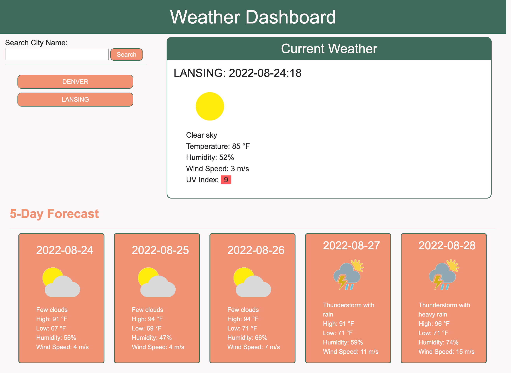

# Weather DashBoard: weather-forecast-data

Module 6 Challenge - Server-Side APIs Challenge: Weather Dashboard

---

## Description

This Weather Dashboard was created to challenge my existing coding abilities, while also applying newly learned skills with server-side API calls using JavaScript. The goal was to use weather databases to provide users weather information about the city they choose. My main focus for this challenge was to have a clean and polished user experience while using JavaScript to make API calls, dynamically update HTML/CSS, and display desired/updated weather information.

### Requirements

A list of requirements derived from acceptance criteria and personal goals:

- Searching a city present current and future weather data.
- Previously searched cities are added to the search history.
- Clicking a city in search history shows weather for that city.
- Use weatherbit.io for API calls.
- Use locals storage to store persistent data.

### Skills Learned/ Improved

Here is a list of some skills I learned and/or improved throughout this project:

- Making API calls
- jQuery syntax
- JS file structure & using more small functions rather than a few large
- Dynamically updating files with JS

Tools used to complete this project:

- VS Code
- Terminal
- Chrome Dev Tools
- GitHub
- weatherbit.io 

## Usage

This application is used primarily to access weather information for cities the user wishes to see. The weather dashboard provides current weather and a 5-day forecast for the specified city. Some of the weather information provided includes:

- Temperature
- Weather description & corresponding weather condition picture
- Humidity
- Wind speed
- UV index that shows a color to show the intensity

### Links

[Link](https://alverson98.github.io/weather-forecast-data/) to deployed website.

[Link](https://github.com/alverson98/weather-forecast-data) to code repository.

## Credits

I received guidance and tips from the instructional staff, TA's, and Students from the University of Denver Coding Boot Camp.
